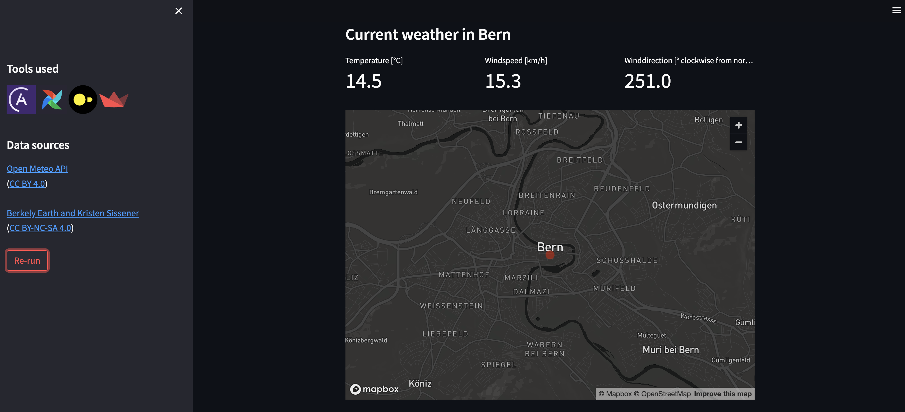
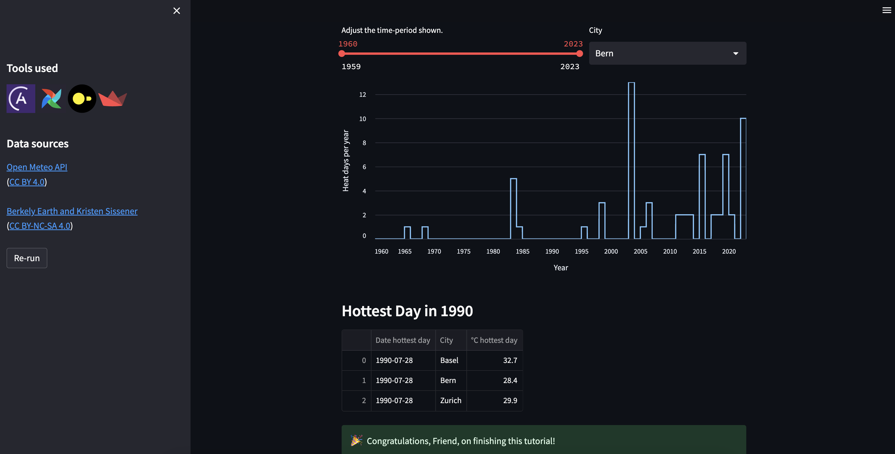
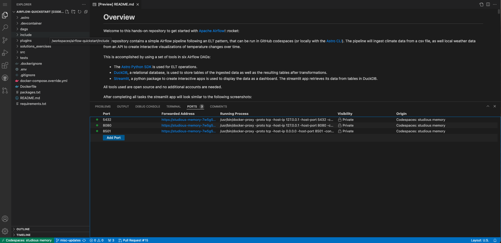
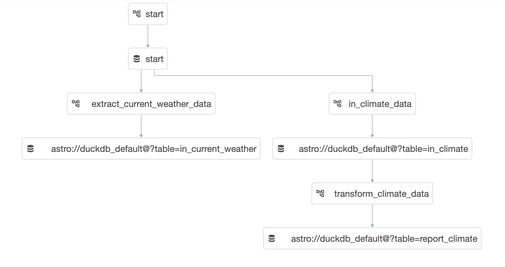
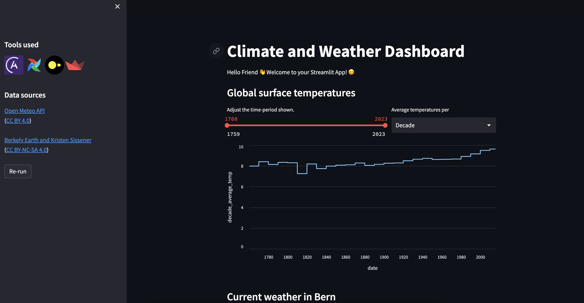
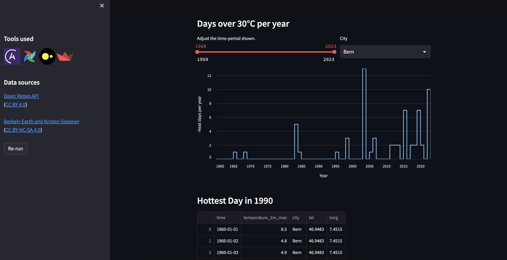
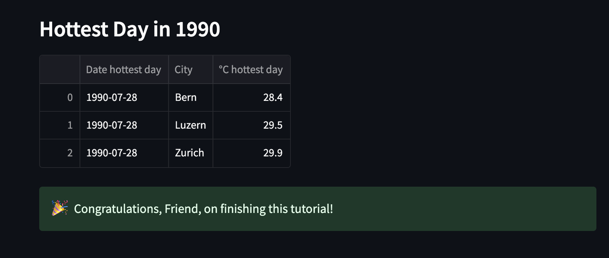

Overview
========

Welcome to this hands-on repository to get started with [Apache Airflow](https://airflow.apache.org/)! :rocket:

This repository contains a simple Airflow pipeline following an ELT pattern that you can run in GitHub codespaces or locally with the [Astro CLI](https://docs.astronomer.io/astro/cli/install-cli). Your pipeline will ingest climate data from a csv file and local weather data from an API to create interactive visualizations of temperature changes over time.

Your pipeline will accomplish this using six Airflow DAGs and the following tools:

- [DuckDB](https://duckdb.org/), a relational database, for storing tables of the ingested data as well as the resulting tables after transformations.
- [Streamlit](https://streamlit.io/), a Python package for creating interactive apps, for displaying the data as a dashboard. The Streamlit app will retrieve its data from tables in DuckDB.

All tools used are open source, so you will not need to create additional accounts.

After completing all tasks, the Streamlit app will look similar to the following screenshots:

## Part 1: Run a fully functional pipeline

Follow the [Part 1 Instructions](#part-1-instructions) to get started!

The ready to run Airflow pipeline consists of 4 DAGs and will:

- Retrieve the current weather for your city from an API.
- Ingest climate data from a local CSV file.
- Load the data into DuckDB.
- Run a transformation on the data to create a reporting table powering a Streamlit app.

## Part 2: Exercises

Follow the [Part 2 Instructions](#part-2-instructions-exercises) to extend the pipeline to show historical weather data for cities of your choice in the Streamlit app.
During this process you will learn about Airflow features including [Datasets](https://docs.astronomer.io/learn/airflow-datasets) and [dynamic task mapping](https://docs.astronomer.io/learn/dynamic-tasks).

## Part 3: Play with it!

Use this repository to explore Airflow best practices, experiment with your own DAGs and as a template for your own projects!

This project was created with :heart: by [Astronomer](https://www.astronomer.io/).

> If you are looking for an entry-level written tutorial where you build your own DAG from scratch, check out: [Get started with Apache Airflow, Part 1: Write and run your first DAG](https://docs.astronomer.io/learn/get-started-with-airflow).

-------------------------------

How to use this repository
==========================

# Setting up

## Option 1: Use GitHub Codespaces

Run this Airflow project without installing anything locally.

1. Fork this repository.
2. Create a new GitHub Codespaces project on your fork. Make sure it uses at least 4 cores!

    
3. Run this command in the Codespaces terminal: `bash ./.devcontainer/post_creation_script.sh`.
4. The Astro CLI will automatically start up all necessary Airflow components as well as the Streamlit app. This can take a few minutes. 
5. Once the Airflow project has started, access the Airflow UI by clicking on the **Ports** tab and opening the forward URL for port 8080.

    

6. Once the Streamlit app is running, you can access it by by clicking on the **Ports** tab and opening the forward URL for port 8501.

## Option 2: Use the Astro CLI

Download the [Astro CLI](https://docs.astronomer.io/astro/cli/install-cli) to run Airflow locally in Docker. `astro` is the only package you will need to install.

1. Run `git clone https://github.com/astronomer/airflow-quickstart.git` on your computer to create a local clone of this repository.
2. Install the Astro CLI by following the steps in the [Astro CLI documentation](https://docs.astronomer.io/astro/cli/install-cli). Docker Desktop/Docker Engine is a prerequisite, but you don't need in-depth Docker knowledge to run Airflow with the Astro CLI.
3. Run `astro dev start` in your cloned repository.
4. After your Astro project has started. View the Airflow UI at `localhost:8080`.
5. View the Streamlit app at `localhost:8501`. NOTE: The Streamlit container can take a few minutes to start up.

# Run the project

## Part 1 Instructions

All DAGs tagged with `part_1` are part of a pre-built, fully functional Airflow pipeline. To run them:

1. Go to `include/global_variables/user_input_variables.py` and enter your own info for `MY_NAME` and `MY_CITY`.
2. Trigger the `start` DAG and unpause all DAGs that are tagged with `part_1` by clicking on the toggle on their lefthand side. Once the `start` DAG is unpaused, it will run once, starting the pipeline. You can also run this DAG manually to trigger further pipeline runs by clicking on the play button on the right side of the DAG.

    The DAGs that will run are:

    - `start`
    - `extract_current_weather_data`
    - `in_climate_data`
    - `transform_climate_data`

3. Watch the DAGs run according to their dependencies, which have been set using [Datasets](https://docs.astronomer.io/learn/airflow-datasets).

    

4. Open the Streamlit app. If you are using Codespaces, go to the **Ports** tab and open the URL of the forwarded port `8501`. If you are running locally go to `localhost:8501`.

    

5. View the Streamlit app, now showing global climate data and the current weather for your city.

    

## Part 2 Instructions (Exercises)

The two DAGs tagged with `part_2` are part of a partially built Airflow pipeline that handles historical weather data. You can find example solutions in the `solutions_exercises` folder.

Before you get started, go to `include/global_variables/user_input_variables.py` and enter your own info for `HOT_DAY` and `BIRTHYEAR`.

### Exercise 1 - Datasets

Both the `extract_historical_weather_data` and `transform_historical_weather_data` DAG currently have their `schedule` set to `None`.

Use Datasets to make: 

- `extract_historical_weather_data` run after the `start` DAG has finished
- `transform_historical_weather_data` run after the `extract_historical_weather_data` DAG has finished

You can find information about how to use the Datasets feature in [this guide](https://docs.astronomer.io/learn/airflow-datasets).

After running the two DAGs in order, view your Streamlit app. You will now see a graph with hot days per year. Additionally, parts of the historical weather table will be printed out.

### Exercise 2 - Dynamic Task Mapping

The tasks in the `extract_historical_weather_data` currently only retrieve historical weather information for one city. Use dynamic task mapping to retrieve information for three cities.

You can find instructions on how to use dynamic task mapping in [this guide](https://docs.astronomer.io/learn/dynamic-tasks). Tip: You only need to modify two lines of code!

After completing the exercise, rerun both `extract_historical_weather_data` and `transform_historical_weather_data`.

In your Streamlit app, you can now select the different cities from the dropdown box to see how many hot days they had per year.

### Exercise 3 - Transformation Using Pandas

The table returned by the `find_hottest_day_birthyear` task will be displayed by your Streamlit app. By default, no transformation is made to the input table in the task, so let's change that!

Use Pandas to transform the data shown in `in_table` to search for the hottest day in your birthyear for each city for which you retrieved data.

Tip: Both, the `in_table` dataframe and the `output_df` dataframe are printed to the logs of the `find_hottest_day_birthyear` task. The goal is to have an output as in the screenshot below. If your table does not contain information for several cities, make sure you completed exercise 2 correctly.

-------------------------------

How it works
============

## Components and infrastructure

This repository uses a [custom codespaces container](https://github.com/astronomer/devcontainer-features/pkgs/container/devcontainer-features%2Fastro-cli) to install the [Astro CLI](https://docs.astronomer.io/astro/cli/install-cli) and forward ports. 

5 Docker containers will be created and relevant ports will be forwarded for:

- The Airflow scheduler
- The Airflow webserver
- The Airflow metastore
- The Airflow triggerer

Additionally, when using Codespaces, the command to run the Streamlit app is automatically run upon starting the environment.

## Data sources

The global climate data in the local CSV file was retrieved from the [Climate Change: Earth Surface Temperature Data Kaggle dataset](https://www.kaggle.com/datasets/berkeleyearth/climate-change-earth-surface-temperature-data) by Berkely Earth and Kristen Sissener, which was uploaded under [CC BY-NC-SA 4.0](https://creativecommons.org/licenses/by-nc-sa/4.0/).

The current and historical weather data is queried from the [Open Meteo API](https://open-meteo.com/) ([CC BY 4.0](https://creativecommons.org/licenses/by/4.0)).

Project Structure
================

This repository contains the following files and folders:

- `.astro`: files necessary for Astro CLI commands.
- `.devcontainer`: the GH codespaces configuration.

-  `dags`: all DAGs in your Airflow environment. Files in this folder will be parsed by the Airflow scheduler when looking for DAGs to add to your environment. You can add your own dagfiles in this folder.
    - `climate_and_current_weather`: folder for DAGs which are used in part 1
        - `extract_and_load`: DAGs related to data extraction and loading
            - `extract_current_weather_data.py`
            - `in_climate_data.py`
        - `transform`: DAGs transforming data
            - `transform_climate_data.py`
    - `historical_weather`: folder for DAGs which are used in part 2
        - `extract_and_load`: DAGs related to data extraction and loading
            - `extract_historical_weather_data.py`
        - `transform`: DAGs transforming data
            - `transform_historical_weather.py`  

- `include`: supporting files that will be included in the Airflow environment.
    - `climate_data`: contains a CSV file with global climate data.
    - `global_variables`: configuration files.
        - `airflow_conf_variables.py`: file storing variables needed in several DAGs.
        - `constants.py`: file storing table names.
        - `user_input_variables.py`: file with user input variables like `MY_NAME` and `MY_CITY`.
    - `meterology_utils.py`: file containing functions performing calls to the Open Meteo API.
    - `streamlit_app.py`: file defining the streamlit app.

- `plugins`: folder to place Airflow plugins. Empty.
- `solutions_exercises`: folder for part 2 solutions.
    - `solution_extract_historical_weather_data.py`: solution version of the `extract_historical_weather_data` DAG.
    - `solution_transform_historical_weather.py`: solution version of the `transform_historical_weather` DAG.
- `src`: contains images used in this README.
- `tests`: folder to place pytests running on DAGs in the Airflow instance. Contains default tests.
- `.dockerignore`: list of files to ignore for Docker.
- `.env`: environment variables. Contains the definition for the DuckDB connection.
- `.gitignore`: list of files to ignore for git. NOTE that `.env` is not ignored in this project.
- `Dockerfile`: the Dockerfile using the Astro CLI.
- `packages.txt`: system-level packages to be installed in the Airflow environment upon building of the Dockerimage.
- `README.md`: this Readme.
- `requirements.txt`: python packages to be installed to be used by DAGs upon building of the Dockerimage.
